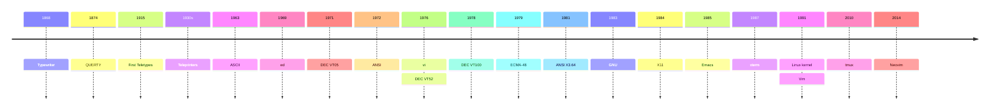

## Brief timeline

<!-- TODO: This is probably incorrect: -->

<!-- TODO: double check dates, see if this all makes sense -->

---

## Typewriters

^ 1840
typewriters were never a terminal, but terminals come from it
these artifacts of the past are still there today, like `\r\n`

---

Also:

# _You can just do things_

For the sake of doing them.

---

## When to use one or the other?

It depends...

- If you need interactivity: **TUIs**
- If you need the ability to pipe into/from other commands, scripting, etc: **CLIs**
- If you need both: **do both** 😄

^ can detect if being piped based on if in our out are TTYs

---
