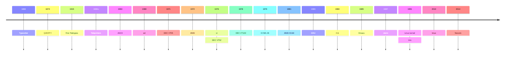

build-lists: true
slidenumbers: true
footer: Carlos Becker - Gophercon Latam 2025
slide-transition: fade(0.5)
theme: Charm

# Serving TUIs over SSH using Go ✨


---

# Why even bother?


Isn't the world basically web apps now?

- Developer tooling is largely terminal-first
- Novelty (ssh terminal.coffee)
- Cultural and aesthetic appeal
- Nostalgia / retro-futurism
- Resource usage / performance
- Security

^ before starting with anything, i know i have to convince you to care, or at least be a little curious about all this. so here we go.
probably not everyone works on terminal tooling though
there's no insecure secure shell

---

# $ whoami


Carlos Alexandro Becker

- @caarlos0 most places
- works @charmbracelet
- maintainer @goreleaser
- https://caarlos0.dev

<!-- TODO: photo -->

---

# Agenda


- TUI vs CLI
- Intro to terminals
- Intro to SSH
- Making a TUI in Go
- Serving it over SSH
- Closing thoughts

^ so, we already seen some reasons to do this, but let's explore a bit TUIs vs
CLIs, an intro to terminals (and ansi seqs), an intro to ssh, then we'll move
to actually writing a TUI and serving it, and finally, and then some time for
questions

---


# TUIs & CLIs

---

## Command Line Interfaces


- User gives input through commands, gets results printed below them
- Might also take inputs through args, flags, environment variables
- Are usually non-interactive (except maybe for asking confirmations)
- Examples: shells (bash, zsh, fish), git, coreutils

<!-- TODO: maybe example gif? -->

---

## Text-based User Interfaces


- Present themselves as an interactive application, using ASCII and Unicode characters to drawn the user interface
- Usually mimics text inputs, buttons, etc
- Modern examples: vim/nvim, htop, btop, tig, lazygit, lazydocker, k9s
- Classic examples: banking software, point of sale, etc

^ note that some apps might require specific fonts with extra symbols
^ fonts its a whole lot of another problem

<!-- TODO: maybe example gif? -->

---

## When to use one or the other?


It depends...

- If you need interactivity: **TUIs**
- If you need the ability to pipe into/from other commands, scripting, etc: **CLIs**
- If you need both: **do both** 😄

^ can detect if being piped based on if in our out are TTYs

---

# Terminals 101


---

## Typewriters


^ 1840
typewriters were never a terminal, but terminals come from it
these artifacts of the past are still there today, like `\r\n`

---

## Teletype Writers (TTY)


^ Model 33 1928ish
Teletype Corporation trademarked “teletype” for its teleprinters back in 1928.
The basic idea behind is you have two machines linked together.
Letters typed in one machine are sent and print into the other machine as well.
TTY still used today to refer to terminals, emulated or otherwise

---

## Video Terminals


^ still connected to another computer, but having a video display for output instead of a printer
VTs introduced special chars to control the terminal, like \esc, \n, \r, \a bell and \t tab, as well as support for ansi escape sequences - more about it later
VT100 1978

---

## Terminal Emulators


- XTerm was the first terminal emulator, based on VT102
- Then it incorporated more features from other video terminals
- The Terminal application you use, whichever it might be, is a terminal emulator

^ 1984
around that time, VT100 was the most popular video term, and a little bit after, we got XTerm - a terminal emulator, because you guessed it: it emulated a VT - specifically, VT102
later on it incorporated more features from more recents VTs, until VTs became a thing of the past for most of us
whatever it is you call a terminal today, is actually a terminal emulator - its fine to call it a terminal though, we all do

---

## ANSI & ECMA-48


- ANSI was the first standard
- Colors, Cursor movement, etc
- ECMA-48 is the international standardization of what began as ANSI
- ANSI was withdrawn in 1994
- Everyone still calls them ANSI Sequences

^ then we got the first attempt to a standard: ANSI - it had colors, cursor movements, and many more. This is all in the context of slow connections, so things need to be efficient (keep that in mind)
then ecma-48 was the international version of ansi, and ansi was withdrawn as a standard
all that said, no one calls them ecma-48 sequenences

---

## Brief timeline

<!-- TODO: This is probably incorrect: -->




<!-- TODO: double check dates, see if this all makes sense -->

---

## ANSI sequences


- Start with an ESC (`\e`, `^[`, `\033`, or `\x1b`)
- Several types of sequences: ESC, CSI, OSC, DCS, APC

```bash
printf '\e[6n'
printf '\e[033mHello Gophercon\e[0m'
printf '\e[=31;1u'
printf '\e]0;Hello Gophercon\a'
printf '\eP+q636F6C73\e\'
```

^ ESC save cursor position
Control seq introducer prints text in yellow
CSI enable kitty extended terminal
OS Command sets term title
DCS device control string request terminal capabilities, in this case, cols

---

## Time to Go


We can do the same with Lip Gloss and x/ansi

```go
import (
  "github.com/charmbracelet/lipgloss/v2")
  "github.com/charmbracelet/x/ansi"
)

fmt.Print(ansi.RequestCursorPositionReport)
style := lipgloss.NewStyle().Foreground(lipgloss.Yellow)
lipgloss.Println(style.Render("Hello Gophercon!"))
fmt.Print(ansi.KittyKeyboard(ansi.KittyAllFlags, 1))
fmt.Print(ansi.SetWindowTitle("Hello Gophercon!"))
fmt.Print(ansi.RequestTermcap("cols"))
```

^ at charm we have a couple of libs
lipgloss handles styling, and ansi has helpers for all common and some uncommon ansi sequences
Most of the time, you'll only need lipgloss though

---


^ the ansi sequences are hidden :)

---

# The Secure SHell


^ Now that we learned a bit about terminals, and ansi sequences, lets move into ssh

<!-- TODO: simple ssh connection flow maybe? -->

---

## SSH


- widely available
- end-to-end public/private key encryption
- user identification through public keys
- SFTP and SCP to transfer files if needed
- can pipe from/into a host from your computer
- can forward ports (which allow for some clever hacks)
- this is your reminder to replace your RSA key with a Ed25519 key 🙏

^ as the name implies - its a secure shell, its meant to allow remote access. The most common usage (that most of us know) is to ssh into a shell, or use it as a git remote
traffic is end to end encrypted using AES usually - users can be authorized several ways, including public key auth, in which case they can also be uniquely identified by their key
since ssh is a regular process, you can pipe into/from it as well (like we saw before)
you can also forward ports from your local machine to the remote, and vice versa
finally, if you still use RSA, this is a public safety announcement: replace it with a more modern key, like a ed25519

---

## SSH


Biggest problems:

- Non-technical people don't use or know what SSH is
- SSH doesn't send the hostname as part of the initial handshake, so no host-based routing is possible, which makes hosting harder
- i18n: SSH doesn't send TZ and LC\* by default

^ non technical people and vibe coders in general might not know what ssh even is
^ its a bit harder to serve, as the hostname is not sent as part of the initial ssh handshake. workarounds include routing based on port and user
^ i18n might be a bit more difficult, as SSH doesn't send the required variables

---

# Making a TUI


<!-- TODO: add an image here? -->

^ That said, lets step into making an interactive app

---

## Bubble Tea


A powerful little TUI framework

- Elm-style: Init, Update, View
- Automatically downgrade colors based on user terminal
- Many features built in: alt screens, resizing, background color detection, cursor, focus/blur, suspend/resume, kitty keyboard, etc
- Can be extended with Bubbles (components) and Huh (forms)

^ for that, we'll use charm's bubbletea
^ it follows the elm-architecture, and, on v2, automatically downgrades colors based on the user terminal profile
^ it has a lot of features built in, like native cursor, kitty keyboard, etc. composition is also coming eventually!
^ last but not least, you can use it with conjunction of things like Bubbles and Huh to make better interactive apps

<!-- TODO: bubbletea flow? -->

---

## Bubble Tea

The model:


```go
import tea "github.com/charmbracelet/bubbletea/v2"

var _ tea.ViewModel = model{}

type model struct {}
```

^ we're gonna implement a simple app with it: it'll show a countdown, and stop it on any keypress. Its simple, but enough for what I want to demonstrate right now
to do that, we need to create a struct - lets call it model, and make sure it implements tea.ViewModel
if we need cursor handling, we would need to use tea.CursorModel instead

---

## Bubble Tea


`Init`:

```go
import "github.com/charmbracelet/bubbles/v2/stopwatch"

type model struct {
	sw       stopwatch.Model
	quitting bool
}

func (m model) Init() tea.Cmd {
  return m.sw.Start()
}
```

^ then, we import stopwatch from bubbles, and embed it in our model
we also implement Init, which comes from the tea.Model interface - for our case it simply delegates to stopwatch's init

---

## Bubble Tea


`Update`:

```go
func (m model) Update(msg tea.Msg) (tea.Model, tea.Cmd) {
  switch msg.(type) {
  case tea.KeyPressMsg:
    m.quitting = true
    return m, tea.Quit
  }
  var cmd tea.Cmd
  m.sw, cmd = m.sw.Update(msg)
  return m, cmd
}
```

^ finally, we implement Update. Here's where we handle the messages we get from the bubbletea loop.
Basically, we switch against its type, if its a keypress, we instruct the program to quit, otherwise, we delegate it to stopwatch. A note here is that ideally, IO should happen only inside tea.Cmds

---

## Bubble Tea


`View`:

```go
func (m model) View() string {
	if m.quitting {
		return lipgloss.NewStyle().
			Foreground(lipgloss.BrightBlack).
			Render("Bye!")
	}
	return lipgloss.NewStyle().
		Foreground(lipgloss.Yellow).
		Bold(true).
		Italic(true).
		Render(m.sw.View())
}
```

^ finally, the last piece of the interface: View.
here, we create a style, and render stopwatch's view - which is basically a string

---

## Bubble Tea


Run it:

[.code-highlight: none]
[.code-highlight: 2]
[.code-highlight: 8-12]
[.code-highlight: all]

```go
func main() {
  if _, err := tea.NewProgram(newModel()).Run(); err != nil {
    fmt.Fprintln(os.Stderr, err.Error())
    os.Exit(1)
  }
}

func newModel() model {
  return model{
    stopwatch.New(stopwatch.WithInterval(10 * time.Second)),
  }
}
```

^ then, we create a main function that creates a new program using our model, and runs it, checking for errors
notice we have a newModel func - this will come in handy in a few :)

---


^ and with that, we have our first interactive app
it aint much, but its honest work

---

# Serving it over SSH


^ now, let's finally serve these over ssh

---

## Wish


You can't just wish that... or can you?

```go
import (
  "github.com/charmbracelet/log/v2"
  "github.com/charmbracelet/ssh"
  "github.com/charmbracelet/wish/v2"
  "github.com/charmbracelet/wish/v2/logging"
  btm "github.com/charmbracelet/wish/v2/bubbletea"
)
```

^ for that, we'll use charm's wish
wish is a library on top of x/crypto/ssh and gliderlabs/ssh.
it tries to "mimic" some concepts of the standard http library for ssh apps
so we have the concept of middlewares as well, and also some functional options
for all that, we'll need these imports

---

## Wish


Creating a server:

[.code-highlight: none]
[.code-highlight: 1-9]
[.code-highlight: 9-12]
[.code-highlight: all]

```go
srv, err := wish.NewServer(
  wish.WithAddress("localhost:23234"),
  wish.WithMiddleware(
    btm.Middleware(func(ssh.Session) (tea.Model, []tea.ProgramOption) {
      return newModel(), nil
    }),
    logging.StructuredMiddleware(),
  ),
)
if err != nil {
  log.Fatal("Could not create wish server", "err", err)
}
```

^ first, we create a server - for our case, its enough to listen to localhost
we also use with middleware, and use the wish bubbletea middleware. there we could return some options if we wanted (like altscreen), but we don't need it now. so we simply return calling oour newModel func from before
we also add a structured logging middleware. this will log all incoming connections. there's also prometheus middlewares, rate limit, and more
and we check errors, of course

---

## Wish


Starting the server:

[.code-highlight: none]
[.code-highlight: 1]
[.code-highlight: 2-5]
[.code-highlight: all]

```go
log.Info("Starting", "addr", ":23234")
if err = srv.ListenAndServe(); err != nil &&
  !errors.Is(err, ssh.ErrServerClosed) {
  log.Fatal("Could not start server", "err", err)
}
```

^ finally, we listen and serve
also checking for errors.
server closed happens when the server is stopped, and its not bad in this particular context.

---

^ and here we are, running the same app as before, now over ssh!


---

## Wish: auth methods


[.code-highlight: none]
[.code-highlight: 1-3]
[.code-highlight: 7-10]
[.code-highlight: 1-3, 7-10]

```go
carlos, _, _, , _ := ssh.ParseAuthorizedKey([]byte(
  "ssh-ed25519 AAAAC3NzaC1lZDI1NTE5AAAAIL...",
))

srv, err := wish.NewServer(
  // ...
  wish.WithPublicKeyAuth(func(_ ssh.Context, key ssh.PublicKey) bool {
    log.Info("public key")
    return ssh.KeysEqual(key, carlos)
  }),
  // ...
)
```

^ now, we probably want public key auth
in this example I have my pub key hard coded, but in the so called real world you can get it from a db, or some other type of storage

---

## Wish: auth methods


[.code-highlight: 3-6]

```go
srv, err := wish.NewServer(
  // ...
  wish.WithPasswordAuth(func(_ ssh.Context, password string) bool {
    log.Info("password")
    return password == "how you turn this on"
  }),
  // ...
)
```

^ we can also use passwords, if public key is not what you need
this enables the viper cobra btw

---

## Wish: auth methods


[.code-highlight: none]
[.code-highlight: 3]
[.code-highlight: 5]
[.code-highlight: 6]
[.code-highlight: 7-11]
[.code-highlight: 12]
[.code-highlight: 17-18]
[.code-highlight: 3-19]

```go
srv, err := wish.NewServer(
  // ...
  wish.WithKeyboardInteractiveAuth(func(_ ssh.Context, ch gossh.KeyboardInteractiveChallenge) bool {
      log.Info("keyboard-interactive")
      answers, err := ch(
        "Welcome to my server!", "Please answer these questions:",
        []string{
          "♦ How much is 2+3: ",
          "♦ Which editor is best, vim or emacs? ",
          "♦ Tell me your best secret: ",
        },
        []bool{true, true, false},
      )
      if err != nil {
        return false
      }
      return len(answers) == 3 && answers[0] == "5" &&
            answers[1] == "vim" && answers[2] != ""
  }),
  // ...
)
```

^ finally, we can use keyboard interactive challenges as well
in this example, its 3 static questions, but you can do whatever you want, there. the bool array is whether to echo the response or not
ln6 name & instruction

---


^ and this is we trying out all the 3 auth methods

---

# What's next?


^ ok.. what now?

---


## Next steps

^ there's always more, isn't it?

- Learn more about ANSI sequences (see: [charm.sh/sequin](https://charm.sh/sequin))
- Use more components from charm.sh/bubbles and [charm.sh/huh](https://charm.sh/huh)
- Dig through charm.sh/wish and [charm.sh/bubbletea](https://charm.sh/bubbletea) examples folders
- Deploy it somewhere (easy enough on [fly.io](https://fly.io))
- Tell the world about what you built 🔥

---


# Thank you!

## Questions?

---

## Links

[.build-lists: false]


- [charm.sh](https://charm.sh)
- [caarlos0.dev](https://caarlos0.dev)
- [goreleaser.com](https://goreleaser.com)
- [caarlos0/gophercon-2025](https://github.com/caarlos0/gophercon-2025)

<!-- # TODO: add more images -->
<!---->
<!-- - ssh handshake -->
<!-- - bubbletea loop -->
<!-- - some cool examples maybe? -->
<!---->
<!-- # TODO: add links to everything -->
<!---->
<!-- # TODO: pty vs tty? -->
<!---->
<!-- # TODO: maybe add some dates? -->
<!---->
<!-- ssh gophercon-talk.fly.dev -->
