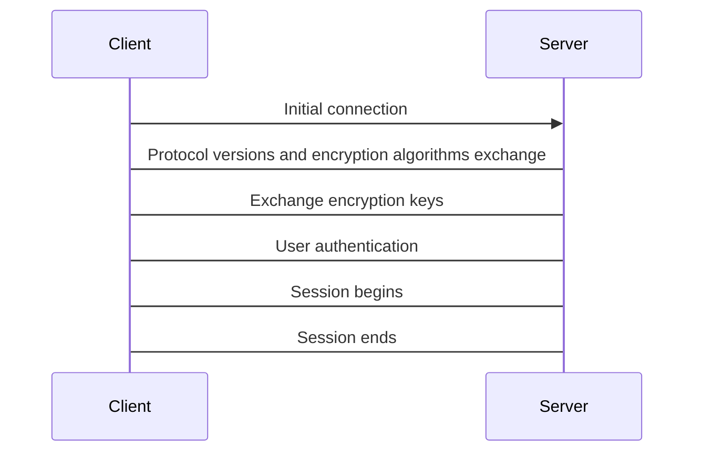

build-lists: true
slidenumbers: true
footer: Carlos Becker - Gophercon Latam 2025
slide-transition: fade(0.5)
theme: Charm


# Serving TUIs over SSH using Go ✨

---


# Why even bother?

Isn't the world basically web apps now?

- Developer tooling is largely terminal-first
- Novelty (ssh terminal.coffee)
- Cultural and aesthetic appeal
- Nostalgia / retro-futurism
- Resource usage / performance
- Power users

^ before starting with anything, i know i have to convince you to care, or at
least be a little curious about all this. so here we go.
probably not everyone works on terminal tooling though
there's also the novelty factor - being different from competition
the cultural aspect also weights in, bringing nostalgia and retro-futurism
on top of that, low resource usage, usually great performance, and power users
love it

---


Also:

# _You can just do things ✨_

For the sake of doing them.

---

[.build-lists: false]


# $ whoami

Carlos Alexandro Becker

- @caarlos0 most places
- works @charmbracelet
- maintains @goreleaser
- https://caarlos0.dev


---


# Agenda

- CLIs x TUIs
- Intro to terminals
- Intro to SSH
- Building a TUI in Go
- Serving it over SSH
- Closing thoughts

^ so, we already seen some reasons to do this, but let's explore a bit TUIs vs
CLIs, an intro to terminals (and ansi seqs), an intro to ssh, then we'll move
to actually writing a TUI and serving it, and finally, and then some time for
questions

---


# CLIs x TUIs

---


## Command Line Interfaces

- User gives input through commands, gets results printed below them
- Might take extra inputs through args, flags, env, config files
- Are usually non-interactive
- Examples: shells (bash, zsh, fish), git, coreutils, kubectl

^ you can think of a shell, or things like git, kubectl, and many others
you type commands giving them inputs and it prints the ouput, and that's pretty
much it
some times it might ask you to type any key to confirm or something like that,
but usually, no interaction once the command is sent
also, no UI either, it's usually pipe-able text output

<!-- TODO: maybe example gif? -->

---


## Text-based User Interfaces

- Present themselves as an interactive application, using ASCII and Unicode characters to drawn the user interface
- Might mimic elements from modern UIs: text inputs, buttons, etc
- Classic examples: banking software, point of sale, etc
- Modern examples: vim/nvim, htop, btop, tig, lazygit, lazydocker, k9s

^ note that some apps might require specific fonts with extra symbols
fonts its a whole lot of another problem

<!-- TODO: maybe example gif? -->

---

## When to use one or the other?


It depends...

- If you need interactivity: **TUIs**
- If you need the ability to pipe into/from other commands, scripting, etc: **CLIs**
- If you need both: **do both** 😄

^ can detect if being piped based on if in our out are TTYs

---


# Terminals

---


## Teletype Writers (TTY)

- Basically a network-connected typewriter
- Send text over the wire to other machine
- Get text back and prints it


^ Model 33 1930
Teletype Corporation trademarked “teletype” for its teleprinters back in 1928.
The basic idea behind is you have two machines linked together.
Letters typed in one machine are sent and print into the other machine as well.
TTY still used today to refer to terminals, emulated or otherwise

---


## Video Terminals

- Like a teletype
- Screen instead of paper


^ still connected to another computer, but having a video display for output instead of a printer
VTs introduced special chars to control the terminal, like esc, \n, \r, \a bell and \t tab, as well as support for ansi escape sequences - more about it later
VT100 1978
vt100 was one of the most popular video terminals

---

## Terminal Emulators


- XTerm was the first terminal emulator, based on VT102
- Then it incorporated more features from other video terminals
- The Terminal application you use, whichever it might be, is a terminal emulator

^ 1984
around that time, VT100 was the most popular video term, and a little bit after,
we got XTerm - a terminal emulator, because you guessed it: it emulated a VT -
specifically, VT102
later on it incorporated more features from more recents VTs, until VTs became a
thing of the past for most of us
whatever it is you call a terminal today, is actually a terminal emulator - its
fine to call it a terminal though, we all do

---


## ANSI and ECMA-48

- ANSI was the first standard
- Colors, Cursor movement, etc
- ECMA-48 is the international standardization of what began as ANSI
- ANSI was withdrawn in 1994
- Everyone still calls them ANSI Sequences

^ then we got the first attempt to a standard: ANSI - it had colors, cursor
movements, and many more.
This is all in the context of slow connections, so things need to be efficient
(keep that in mind)
then ecma-48 was the international version of ansi, and ansi was withdrawn as a standard
all that said, no one calls them ecma-48 sequenences

---


## ANSI sequences

- Start with an ESC (`\e`, `^[`, `\033`, or `\x1b`)
- Several types of sequences: ESC, CSI, OSC, DCS, APC

[.code-highlight: none]
[.code-highlight: 1]
[.code-highlight: 2]
[.code-highlight: 3]
[.code-highlight: 4]
[.code-highlight: 5]
[.code-highlight: all]

```bash
printf '\e[6n'
printf '\e[033mHello Gophercon\e[0m'
printf '\e[=31;1u'
printf '\e]0;Hello Gophercon\a'
printf '\eP+q636F6C73\e\'
```

^ ESC save cursor position
Control seq introducer prints text in yellow
CSI enable kitty extended terminal
OS Command sets term title
DCS device control string request terminal capabilities, in this case, cols

---


## Reading them

- You can make ANSI sequences human-readable with
  [charm.sh/sequin](https://charm.sh/sequin)
- Its built on top of
  `charmbracelet/x/ansi`


^ if you also can't really read any of that, i recommend using sequin
if you fancy learning how all this works, you can poke into charm/x/ansi as well

---


## Time to Go

We can do the same with Lip Gloss and x/ansi

```go
import (
  "github.com/charmbracelet/lipgloss/v2")
  "github.com/charmbracelet/x/ansi"
)

fmt.Print(ansi.RequestCursorPositionReport)
style := lipgloss.NewStyle().Foreground(lipgloss.Yellow)
lipgloss.Println(style.Render("Hello Gophercon!"))
fmt.Print(ansi.KittyKeyboard(ansi.KittyAllFlags, 1))
fmt.Print(ansi.SetWindowTitle("Hello Gophercon!"))
fmt.Print(ansi.RequestTermcap("cols"))
```

^ at charm we have a couple of libs
lipgloss handles styling, and ansi has helpers for all common and some uncommon ansi sequences
Most of the time, you'll only need lipgloss though

---


^ the ansi sequences are hidden :)

---


# The Secure SHell

^ Now that we learned a bit about terminals, and ansi sequences, lets move into ssh

<!-- TODO: simple ssh connection flow maybe? -->

---


## SSH

How it works[^1]:

[^1]: _Very_ summarized.



^ this is a very summarized version on how the handshake works
so, basically, the client inits the connection, then both client and server
exchange supported protocol version and encryption algorithms, decide which to
use, exchange encryption keys using diffie-hellman (for example)
From that point forward the connection is encrypted.
Then, finally user authentication happens, and if the server accepts, the ssh
session begins at that point, until either party closes it.

---

## SSH


### Biggest Ws:

- Widely available
- End-to-end encryption by default
- User identification through public keys
- Can pipe from/into a host from your computer
- Can forward ports (which allow for some clever hacks)

**Friendly reminder: replace your RSA keys 🙏**

^ as the name implies - its a secure shell, its meant to allow remote access. The most common usage (that most of us know) is to ssh into a shell, or use it as a git remote
traffic is end to end encrypted using AES usually - users can be authorized several ways, including public key auth, in which case they can also be uniquely identified by their key
since ssh is a regular process, you can pipe into/from it as well (like we saw before)
you can also forward ports from your local machine to the remote, and vice versa
finally, if you still use RSA, this is a public safety announcement: replace it with a more modern key, like a ed25519

---

## SSH


### Biggest Ls:

- Most non-technical people don't use or know what SSH is
- SSH doesn't send the `hostname` as part of the initial handshake
- _i18n_ and _l10n_: SSH doesn't send `TZ` and `LC*` by default

^ non technical people and vibe coders in general might not know what ssh even is
its a bit harder to serve, as the hostname is not sent as part of the initial ssh handshake. workarounds include routing based on port and user, so no host-based routing is possible, which makes hosting harder
i18n might be a bit more difficult, as SSH doesn't send the required variables
yeah, that should be enough for what we plan to do today!

---


# Making a TUI

<!-- TODO: add an image here? -->

^ That said, lets step into making an interactive app

---


## Bubble Tea

**A powerful little TUI framework**.

- Elm-style: `Init`, `Update`, `View`
- Automatically downgrade colors based on user's terminal
- Many features built in: alt screens, resizing, background color detection, cursor, focus/blur, suspend/resume, kitty keyboard, etc
- Can be extended with Bubbles (components) and Huh (forms)

^ for that, we'll use charm's bubbletea
it follows the elm-architecture, and, on v2, automatically downgrades colors based on the user terminal profile
it has a lot of features built in, like native cursor, kitty keyboard, etc. composition is also coming eventually!
last but not least, you can use it with conjunction of things like Bubbles and Huh to make better interactive apps

<!-- TODO: bubbletea flow? -->

---


## Bubble Tea


---


## Bubble Tea

[.code-highlight: none]
[.code-highlight: 1]
[.code-highlight: 3]
[.code-highlight: 5]
[.code-highlight: all]

```go
import tea "github.com/charmbracelet/bubbletea/v2"

var _ tea.ViewModel = model{}

type model struct {}
```

^ we're gonna implement a simple app with it: it'll show a countdown, and stop it on any keypress.
Its simple, but enough for what I want to demonstrate right now
to do that, we need to create a struct - lets call it model, and make sure it implements tea.ViewModel
if we need cursor handling, we would need to use tea.CursorModel instead
we force model to conform to tea.ViewModel{}

---


## Bubble Tea

```go
import "github.com/charmbracelet/bubbles/v2/stopwatch"

type model struct {
	sw       stopwatch.Model
	quitting bool
}

func (m model) Init() tea.Cmd {
  return m.sw.Start()
}
```

^ then, we import stopwatch from bubbles, and add it to our model
we also implement Init, which comes from the tea.Model interface - for our case it simply delegates to stopwatch's init
the quitting bool there will be important later :)

---


## Bubble Tea

[.code-highlight: none]
[.code-highlight: 1,10]
[.code-highlight: 2,6]
[.code-highlight: 3-5]
[.code-highlight: 7-9]
[.code-highlight: all]

```go
func (m model) Update(msg tea.Msg) (tea.Model, tea.Cmd) {
  switch msg.(type) {
  case tea.KeyPressMsg:
    m.quitting = true
    return m, tea.Quit
  }
  var cmd tea.Cmd
  m.sw, cmd = m.sw.Update(msg)
  return m, cmd
}
```

^ then, we implement Update. Here's where we handle the messages we get from the bubbletea loop.
Basically, we switch against its type, if its a keypress, we instruct the
program to quit, otherwise, we delegate it to stopwatch. A note here is that
ideally, IO should happen only inside tea.Cmds

---


## Bubble Tea

[.code-highlight: none]
[.code-highlight: 2-3]
[.code-highlight: 4-7]
[.code-highlight: 14]
[.code-highlight: 11-13]
[.code-highlight: all]

```go
var (
	byeStyle = lipgloss.NewStyle().
			Foreground(lipgloss.BrightBlack)
	swStyle = lipgloss.NewStyle().
		Foreground(lipgloss.Yellow).
		Bold(true).
		Italic(true)
)

func (m model) View() string {
	if m.quitting {
		return byeStyle.Render("Bye!")
	}
	return swStyle.Render(m.sw.View())
}
```

^ finally, the last piece of the interface: View.
here, we create a couple of styles, and render stopwatch's view - which is basically a string
we also check if quitting is true, and render a good bye message instead.
note that the styles might need to be stored within the model if we need
something more dynamic (like diff colors for light/dark bg)

---


## Bubble Tea

[.code-highlight: none]
[.code-highlight: 2,5]
[.code-highlight: 8-12]
[.code-highlight: all]

```go
func main() {
  if _, err := tea.NewProgram(newModel()).Run(); err != nil {
    fmt.Fprintln(os.Stderr, err.Error())
    os.Exit(1)
  }
}

func newModel() model {
  return model{
    stopwatch.New(stopwatch.WithInterval(10 * time.Second)),
  }
}
```

^ now the last step: running it
to do that, we create a main function that creates a new program using our
model, and runs it, checking for errors
notice we have a newModel func - this will come in handy in a few :)

---


^ and with that, we have our first interactive app
it aint much, but its honest work

---


## Bubble Tea

Let's add a spinner as well:

[.code-highlight: none]
[.code-highlight: 1]
[.code-highlight: 5]
[.code-highlight: all]

```go
import "github.com/charmbracelet/bubbles/v2/spinner"

type model struct {
	sw       stopwatch.Model
	sp       spinner.Model
	quitting bool
}
```

^ just to demonstrate how to use multiple models, lets add a spinner as well.
we can import the bubbles spinner pkg, and add its model into our own.

---


## Bubble Tea

[.code-highlight: none]
[.code-highlight: 2,5]
[.code-highlight: 4]
[.code-highlight: all]

```go
func (m model) Init() tea.Cmd {
	return tea.Batch(
		m.sw.Start(),
		m.sp.Tick,
	)
}
```

^ then, on init, we need to make sure that both the stopwatch and the spinner
are triggered.

---


## Bubble Tea

[.code-highlight: none]
[.code-highlight: 8]
[.code-highlight: 10]
[.code-highlight: 11-12]
[.code-highlight: 13]
[.code-highlight: all]

```go
func (m model) Update(msg tea.Msg) (tea.Model, tea.Cmd) {
	switch msg.(type) {
	case tea.KeyPressMsg:
		m.quitting = true
		return m, tea.Quit
	}
	var cmd tea.Cmd
	var cmds []tea.Cmd
	m.sw, cmd = m.sw.Update(msg)
	cmds = append(cmds, cmd)
	m.sp, cmd = m.sp.Update(msg)
	cmds = append(cmds, cmd)
	return m, tea.Batch(cmds...)
}
```

^ then, on update, we now need to have a slice of tea.Cmds, and append them, to
them batch return them.
its not much different from before aside of this

---


## Bubble Tea

[.code-highlight: none]
[.code-highlight: 1-4]
[.code-highlight: 11,15]
[.code-highlight: 12]
[.code-highlight: 13]
[.code-highlight: 14]
[.code-highlight: all]

```go
var spinStyle = lipgloss.NewStyle().
	Foreground(lipgloss.BrightMagenta).
	PaddingLeft(1).
	PaddingRight(1)

func (m model) View() string {
	if m.quitting {
		return byeStyle.Render("Bye!")
	}

	return lipgloss.JoinHorizontal(
		lipgloss.Left,
		spinStyle.Render(m.sp.View()),
		swStyle.Render(m.sw.View()),
	)
}
```

^ finally, we add another style for our spinner, and on View, render both the
stopwatch and the spinner.
here, we add a new style for the spinner, then use lipgloss join horizontal to
join both the spinner and the stopwatch

---


# Bubble Tea

[.code-highlight: none]
[.code-highlight: 3]
[.code-highlight: all]

```go
func newModel() model {
  return model{
    sp: spinner.New(spinner.WithSpinner(spinner.Jump)),
    sw: stopwatch.New(stopwatch.WithInterval(time.Second)),
  }
}
```

^ finally, we need to make sure to create our spinner in the model as well.

---


^ and with that, we can run our app again

---


# Serving it over SSH

^ now, let's finally serve these over ssh

---


## Wish

You can't just wish that... or can you?

```go
import (
  "github.com/charmbracelet/log/v2"
  "github.com/charmbracelet/ssh"
  "github.com/charmbracelet/wish/v2"
  "github.com/charmbracelet/wish/v2/logging"
  btm "github.com/charmbracelet/wish/v2/bubbletea"
)
```

^ for that, we'll use charm's wish
wish is a library on top of x/crypto/ssh and gliderlabs/ssh.
it tries to "mimic" some concepts of the standard http library for ssh apps
so we have the concept of middlewares as well, and also some functional options
but first, we'll need these imports

---


## Wish

Creating a server:

[.code-highlight: none]
[.code-highlight: 1,10]
[.code-highlight: 2]
[.code-highlight: 3]
[.code-highlight: 4,9]
[.code-highlight: 5-7]
[.code-highlight: 8]
[.code-highlight: 11-13]
[.code-highlight: all]

```go
srv, err := wish.NewServer(
  wish.WithAddress("localhost:23234"),
  wish.WithHostKeyPath("./.ssh/id_ed25519"),
  wish.WithMiddleware(
    btm.Middleware(func(ssh.Session) (tea.Model, []tea.ProgramOption) {
      return newModel(), nil
    }),
    logging.StructuredMiddleware(),
  ),
)
if err != nil {
  log.Fatal("Could not create wish server", "err", err)
}
```

^ first, we create a server - for our case, its enough to listen to localhost
we also need to set the host key - which you can generate with ssh-keygen
we also use with middleware, and use the wish bubbletea middleware. there we could return some options if we wanted (like altscreen), but we don't need it now. so we simply return calling oour newModel func from before
we also add a structured logging middleware. this will log all incoming connections. there's also prometheus middlewares, rate limit, and more
and we check errors, of course

---


## Wish

Starting the server:

[.code-highlight: none]
[.code-highlight: 1]
[.code-highlight: 2-5]
[.code-highlight: all]

```go
log.Info("Starting", "addr", ":23234")
if err = srv.ListenAndServe(); err != nil &&
  !errors.Is(err, ssh.ErrServerClosed) {
  log.Fatal("Could not start server", "err", err)
}
```

^ finally, we listen and serve
also checking for errors.
server closed happens when the server is stopped, and its not bad in this particular context.

---

^ and here we are, running the same app as before, now over ssh!


---


## Wish: auth methods

[.code-highlight: none]
[.code-highlight: 1-3]
[.code-highlight: 7-10]
[.code-highlight: 1-3, 7-10]

```go
carlos, _, _, , _ := ssh.ParseAuthorizedKey([]byte(
  "ssh-ed25519 AAAAC3NzaC1lZDI1NTE5AAAAIL...",
))

srv, err := wish.NewServer(
  // ...
  wish.WithPublicKeyAuth(func(_ ssh.Context, key ssh.PublicKey) bool {
    log.Info("public key")
    return ssh.KeysEqual(key, carlos)
  }),
  // ...
)
```

^ now, we probably want public key auth
in this example I have my pub key hard coded, but in the so called real world
you can get it from a db, or some other type of storage
we add the WithPublicKeyAuth functional option to our server and that's about it

---


## Wish: auth methods

[.code-highlight: 3-6]

```go
srv, err := wish.NewServer(
  // ...
  wish.WithPasswordAuth(func(_ ssh.Context, password string) bool {
    log.Info("password")
    return password == "how you turn this on" // 🐍
  }),
  // ...
)
```

^ we can also use passwords, if public key is not what you need
this enables the viper cobra btw
same thing here, you'd need to do all the things you generally do with web apps,
hashing, salting, etc, etc. keep in mind this is a simplified example only.

---


## Wish: auth methods

[.code-highlight: none]
[.code-highlight: 3,19]
[.code-highlight: 5,13]
[.code-highlight: 6]
[.code-highlight: 7-11]
[.code-highlight: 12]
[.code-highlight: 17-18]
[.code-highlight: 3-19]

```go
srv, err := wish.NewServer(
  // ...
  wish.WithKeyboardInteractiveAuth(func(_ ssh.Context, ch gossh.KeyboardInteractiveChallenge) bool {
      log.Info("keyboard-interactive")
      answers, err := ch(
        "Welcome to my server!", "Please answer these questions:",
        []string{
          "♦ How much is 2+3: ",
          "♦ Which editor is best, vim or emacs? ",
          "♦ Tell me your best secret: ",
        },
        []bool{true, true, false},
      )
      if err != nil {
        return false
      }
      return len(answers) == 3 && answers[0] == "5" &&
            answers[1] == "vim" && answers[2] != ""
  }),
  // ...
)
```

^ finally, we can use the less-known/common keyboard interactive challenges as well
in this example, its 3 static questions, but you can do whatever you want, there.
the bool array is whether to echo the response or not
ln6 name & instruction

---


^ and this is we trying out all the 3 auth methods

---


## Live examples

```console
$ ssh gophercon-talk.fly.dev    # what we did today
$ ssh git.charm.sh              # soft serve git server
$ ssh modchip.charm.sh          # ai over ssh
$ ssh terminal.pet              # keep it alive
$ ssh terminal.coffee           # buy coffee
$ ssh -p2222 ssh.caarlos0.dev   # confetti
$ ssh -p2223 ssh.caarlos0.dev   # fireworks
$ TZ=America/Sao_Paulo ssh \    # current time in german
  -p23234 -oSendEnv=TZ \
  ssh.caarlos0.dev
```

---


# What's next?

^ ok.. what now?

---


## Next steps

^ there's always more, isn't it?

- Learn more about ANSI sequences (see: [charm.sh/sequin](https://charm.sh/sequin))
- Use more components from [charm.sh/bubbles](https://charm.sh/bubbles) and [charm.sh/huh](https://charm.sh/huh)
- Dig through [charm.sh/wish](https://charm.sh/wish) and [charm.sh/bubbletea](https://charm.sh/bubbletea) examples folders
- Deploy it somewhere (easy enough on [fly.io](https://fly.io))
- Tell the world about what you built 🔥

---


# Thank you!

## Questions?

---


## Links

[.build-lists: false]

- [charm.sh](https://charm.sh)
- [caarlos0.dev](https://caarlos0.dev)
- [goreleaser.com](https://goreleaser.com)
- [caarlos0/gophercon-2025](https://github.com/caarlos0/gophercon-2025)

<!-- TODO: add more images -->
<!-- - ssh handshake -->
<!-- - bubbletea loop -->
<!-- - some cool examples maybe? -->
<!-- TODO: pty vs tty? -->
<!-- TODO: maybe add some dates? -->
<!-- TODO: TOFU? -->
